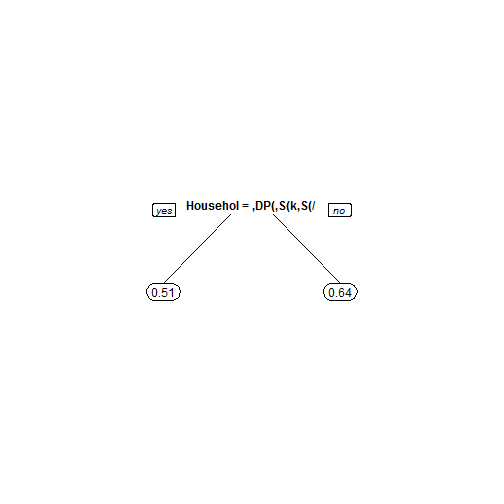
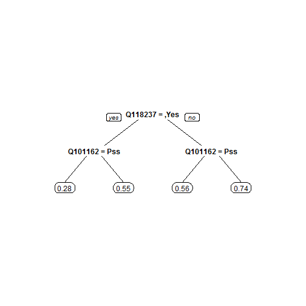

# R Code for edX Competition on *"Analytics Edge"* DataScience Course
======================================================================

#### Author: Fahad Usman
#### Start Date: 24 April 2014

## Data fields

- **UserID** - an anonymous id unique to a given user
- **YOB** - the year of birth of the user
- **Gender** - the gender of the user, either Male, Female, or not provided
- **Income** - the household income of the user. Either not provided, or one of "under $25,000", "$25,001 - $50,000", "$50,000 - $74,999", "$75,000 - $100,000", "$100,001 - $150,000", or "over $150,000".
- **HouseholdStatus** - the household status of the user. Either not provided, or one of "Domestic Partners (no kids)", "Domestic Partners (w/kids)", "Married (no kids)", "Married (w/kids)", "Single (no kids)", or "Single (w/kids)".
- **EducationLevel** - the education level of the user. Either not provided, or one of "Current K-12", "High School Diploma", "Current Undergraduate", "Associate's Degree", "Bachelor's Degree", "Master's Degree", or "Doctoral Degree".
- **Party** - the political party of the user. Either not provided, or one of "Democrat", "Republican", "Independent", "Libertarian", or "Other".
- **Happy** - a binary variable, with value 1 if the user said they were happy, and with value 0 if the user said that were neutral or not happy. This is the variable you are trying to predict.
- **Q124742, Q124122, . . . , Q96024** - 101 different questions that the users were asked on Show of Hands. If the user didn't answer the question, there is a blank. For information about the question text and possible answers, see the file Questions.pdf.
- **votes** - the total number of questions that the user responded to, out of the 101 questions included in the data set (this count does not include the happiness question).

**Note** - Dependent variable is ***Happy*** and is a binary variable. This is also classed as *categorical variable* which only takes two possible values either a person is happy (1) or not (0)...

This part is to try if we can improve our Logistic Regression model by better predicting the happiness using the **TREES** methodology. 

Again we will start by reading in our dataset:


```r
Train = read.csv("C:/Users/607518069/Documents/R Projects/edXCompetition/Data/train.csv")
Test = read.csv("C:/Users/607518069/Documents/R Projects/edXCompetition/Data/test.csv")
```


Check the structure and the summary again, However it should be the same as what I have seen before (Just because it's a norm :) )


```r
str(Train)
```

```
## 'data.frame':	4619 obs. of  110 variables:
##  $ UserID         : int  1 2 5 6 7 8 9 11 12 13 ...
##  $ YOB            : int  1938 1985 1963 1997 1996 1991 1995 1983 1984 1997 ...
##  $ Gender         : Factor w/ 3 levels "","Female","Male": 3 2 3 3 3 2 3 3 2 2 ...
##  $ Income         : Factor w/ 7 levels "","$100,001 - $150,000",..: 1 3 6 5 4 7 5 2 4 6 ...
##  $ HouseholdStatus: Factor w/ 7 levels "","Domestic Partners (no kids)",..: 5 6 5 6 6 6 6 5 5 6 ...
##  $ EducationLevel : Factor w/ 8 levels "","Associate's Degree",..: 1 8 1 7 4 5 4 3 7 4 ...
##  $ Party          : Factor w/ 6 levels "","Democrat",..: 3 2 1 6 1 1 6 3 6 2 ...
##  $ Happy          : int  1 1 0 1 1 1 1 1 0 0 ...
##  $ Q124742        : Factor w/ 3 levels "","No","Yes": 2 1 2 1 2 3 1 2 2 1 ...
##  $ Q124122        : Factor w/ 3 levels "","No","Yes": 1 3 3 3 2 3 1 3 3 1 ...
##  $ Q123464        : Factor w/ 3 levels "","No","Yes": 2 2 2 3 2 2 1 2 2 1 ...
##  $ Q123621        : Factor w/ 3 levels "","No","Yes": 2 3 3 2 2 1 1 3 2 1 ...
##  $ Q122769        : Factor w/ 3 levels "","No","Yes": 2 2 2 1 3 1 1 2 2 2 ...
##  $ Q122770        : Factor w/ 3 levels "","No","Yes": 3 2 2 3 3 1 1 2 3 3 ...
##  $ Q122771        : Factor w/ 3 levels "","Private","Public": 3 3 2 2 3 3 1 3 3 3 ...
##  $ Q122120        : Factor w/ 3 levels "","No","Yes": 2 2 2 2 2 3 1 2 2 2 ...
##  $ Q121699        : Factor w/ 3 levels "","No","Yes": 3 3 3 2 2 3 2 3 3 2 ...
##  $ Q121700        : Factor w/ 3 levels "","No","Yes": 2 3 2 2 3 3 2 2 2 2 ...
##  $ Q120978        : Factor w/ 3 levels "","No","Yes": 1 3 2 3 3 2 2 3 3 3 ...
##  $ Q121011        : Factor w/ 3 levels "","No","Yes": 2 2 2 2 2 3 3 2 3 2 ...
##  $ Q120379        : Factor w/ 3 levels "","No","Yes": 2 3 3 2 3 3 2 2 2 3 ...
##  $ Q120650        : Factor w/ 3 levels "","No","Yes": 3 3 3 3 3 2 3 3 3 3 ...
##  $ Q120472        : Factor w/ 3 levels "","Art","Science": 1 3 3 3 3 2 3 3 2 3 ...
##  $ Q120194        : Factor w/ 3 levels "","Study first",..: 3 2 3 2 2 3 3 3 3 3 ...
##  $ Q120012        : Factor w/ 3 levels "","No","Yes": 2 3 3 1 2 3 2 2 3 3 ...
##  $ Q120014        : Factor w/ 3 levels "","No","Yes": 2 3 2 3 3 1 3 3 2 3 ...
##  $ Q119334        : Factor w/ 3 levels "","No","Yes": 1 3 2 2 2 3 2 3 2 2 ...
##  $ Q119851        : Factor w/ 3 levels "","No","Yes": 3 2 2 3 2 2 3 2 2 3 ...
##  $ Q119650        : Factor w/ 3 levels "","Giving","Receiving": 1 2 2 3 2 1 2 2 2 3 ...
##  $ Q118892        : Factor w/ 3 levels "","No","Yes": 3 3 3 2 3 2 1 3 2 2 ...
##  $ Q118117        : Factor w/ 3 levels "","No","Yes": 3 2 2 3 3 3 1 2 2 2 ...
##  $ Q118232        : Factor w/ 3 levels "","Idealist",..: 2 2 3 3 3 1 1 2 2 3 ...
##  $ Q118233        : Factor w/ 3 levels "","No","Yes": 2 2 2 2 2 2 1 2 3 2 ...
##  $ Q118237        : Factor w/ 3 levels "","No","Yes": 2 3 3 3 2 2 1 2 3 2 ...
##  $ Q117186        : Factor w/ 3 levels "","Cool headed",..: 1 2 2 2 1 3 1 2 3 1 ...
##  $ Q117193        : Factor w/ 3 levels "","Odd hours",..: 1 2 3 2 3 3 1 3 3 3 ...
##  $ Q116797        : Factor w/ 3 levels "","No","Yes": 3 3 2 2 2 1 1 2 2 1 ...
##  $ Q116881        : Factor w/ 3 levels "","Happy","Right": 2 2 3 3 2 2 1 2 2 1 ...
##  $ Q116953        : Factor w/ 3 levels "","No","Yes": 3 3 3 3 1 3 3 3 3 1 ...
##  $ Q116601        : Factor w/ 3 levels "","No","Yes": 3 3 3 2 3 3 1 3 3 1 ...
##  $ Q116441        : Factor w/ 3 levels "","No","Yes": 2 2 2 2 2 2 1 2 2 1 ...
##  $ Q116448        : Factor w/ 3 levels "","No","Yes": 2 3 3 3 2 2 1 2 3 1 ...
##  $ Q116197        : Factor w/ 3 levels "","A.M.","P.M.": 3 2 2 2 2 3 1 2 3 1 ...
##  $ Q115602        : Factor w/ 3 levels "","No","Yes": 3 3 3 3 3 2 1 3 2 1 ...
##  $ Q115777        : Factor w/ 3 levels "","End","Start": 3 2 3 3 3 3 1 3 2 1 ...
##  $ Q115610        : Factor w/ 3 levels "","No","Yes": 3 3 3 3 3 1 1 3 2 1 ...
##  $ Q115611        : Factor w/ 3 levels "","No","Yes": 2 2 3 3 2 2 1 2 2 1 ...
##  $ Q115899        : Factor w/ 3 levels "","Circumstances",..: 2 3 3 2 2 3 1 2 3 1 ...
##  $ Q115390        : Factor w/ 3 levels "","No","Yes": 3 2 2 2 1 2 3 3 2 1 ...
##  $ Q114961        : Factor w/ 3 levels "","No","Yes": 3 3 2 3 2 3 2 2 3 1 ...
##  $ Q114748        : Factor w/ 3 levels "","No","Yes": 3 2 2 2 3 3 3 2 3 1 ...
##  $ Q115195        : Factor w/ 3 levels "","No","Yes": 3 3 3 3 3 2 3 3 3 1 ...
##  $ Q114517        : Factor w/ 3 levels "","No","Yes": 2 3 2 3 2 2 2 2 3 1 ...
##  $ Q114386        : Factor w/ 3 levels "","Mysterious",..: 1 3 3 2 2 3 3 3 3 1 ...
##  $ Q113992        : Factor w/ 3 levels "","No","Yes": 3 1 3 2 2 2 2 2 3 1 ...
##  $ Q114152        : Factor w/ 3 levels "","No","Yes": 3 2 2 2 3 2 2 2 2 1 ...
##  $ Q113583        : Factor w/ 3 levels "","Talk","Tunes": 2 3 2 3 3 3 3 2 3 1 ...
##  $ Q113584        : Factor w/ 3 levels "","People","Technology": 3 2 2 3 2 1 3 2 2 1 ...
##  $ Q113181        : Factor w/ 3 levels "","No","Yes": 2 3 3 3 2 3 3 2 2 1 ...
##  $ Q112478        : Factor w/ 3 levels "","No","Yes": 2 3 3 3 2 1 2 3 2 1 ...
##  $ Q112512        : Factor w/ 3 levels "","No","Yes": 3 2 3 3 3 3 3 3 3 1 ...
##  $ Q112270        : Factor w/ 3 levels "","No","Yes": 1 3 2 3 2 2 2 3 2 1 ...
##  $ Q111848        : Factor w/ 3 levels "","No","Yes": 2 3 3 2 3 3 1 3 2 3 ...
##  $ Q111580        : Factor w/ 3 levels "","Demanding",..: 2 3 3 3 3 3 1 3 2 3 ...
##  $ Q111220        : Factor w/ 3 levels "","No","Yes": 2 2 2 2 2 3 1 2 3 2 ...
##  $ Q110740        : Factor w/ 3 levels "","Mac","PC": 1 1 3 3 2 3 1 2 3 3 ...
##  $ Q109367        : Factor w/ 3 levels "","No","Yes": 2 3 2 2 2 1 2 3 3 1 ...
##  $ Q108950        : Factor w/ 3 levels "","Cautious",..: 2 2 3 2 2 2 1 3 2 1 ...
##  $ Q109244        : Factor w/ 3 levels "","No","Yes": 2 3 2 2 2 1 2 2 2 1 ...
##  $ Q108855        : Factor w/ 3 levels "","Umm...","Yes!": 3 3 3 2 3 3 1 2 3 1 ...
##  $ Q108617        : Factor w/ 3 levels "","No","Yes": 2 1 2 2 2 3 2 2 2 1 ...
##  $ Q108856        : Factor w/ 3 levels "","Socialize",..: 3 1 3 3 3 2 1 2 2 1 ...
##  $ Q108754        : Factor w/ 3 levels "","No","Yes": 2 3 2 2 3 1 3 3 2 1 ...
##  $ Q108342        : Factor w/ 3 levels "","In-person",..: 2 2 2 2 2 2 2 3 3 2 ...
##  $ Q108343        : Factor w/ 3 levels "","No","Yes": 1 3 3 2 2 2 2 2 2 2 ...
##  $ Q107869        : Factor w/ 3 levels "","No","Yes": 3 1 3 2 3 2 2 3 2 2 ...
##  $ Q107491        : Factor w/ 3 levels "","No","Yes": 2 1 3 3 3 3 3 2 3 3 ...
##  $ Q106993        : Factor w/ 3 levels "","No","Yes": 3 1 3 3 3 3 3 3 3 3 ...
##  $ Q106997        : Factor w/ 3 levels "","Grrr people",..: 3 1 3 2 3 1 3 2 3 2 ...
##  $ Q106272        : Factor w/ 3 levels "","No","Yes": 3 1 3 3 2 2 3 2 3 3 ...
##  $ Q106388        : Factor w/ 3 levels "","No","Yes": 2 1 2 2 2 2 2 2 2 2 ...
##  $ Q106389        : Factor w/ 3 levels "","No","Yes": 3 1 2 2 2 2 3 3 3 3 ...
##  $ Q106042        : Factor w/ 3 levels "","No","Yes": 3 1 3 2 2 3 2 3 3 3 ...
##  $ Q105840        : Factor w/ 3 levels "","No","Yes": 1 1 3 2 2 3 2 2 3 2 ...
##  $ Q105655        : Factor w/ 3 levels "","No","Yes": 2 1 3 2 3 3 3 3 3 2 ...
##  $ Q104996        : Factor w/ 3 levels "","No","Yes": 3 1 3 2 3 2 3 3 2 3 ...
##  $ Q103293        : Factor w/ 3 levels "","No","Yes": 2 1 2 3 3 2 2 2 2 3 ...
##  $ Q102906        : Factor w/ 3 levels "","No","Yes": 2 1 2 2 2 2 2 2 2 3 ...
##  $ Q102674        : Factor w/ 3 levels "","No","Yes": 2 1 3 2 2 2 2 2 3 2 ...
##  $ Q102687        : Factor w/ 3 levels "","No","Yes": 3 1 3 3 3 3 2 3 2 3 ...
##  $ Q102289        : Factor w/ 3 levels "","No","Yes": 2 1 2 2 3 3 3 3 2 1 ...
##  $ Q102089        : Factor w/ 3 levels "","Own","Rent": 2 1 2 2 2 3 2 2 2 1 ...
##  $ Q101162        : Factor w/ 3 levels "","Optimist",..: 2 1 2 3 2 2 2 2 2 1 ...
##  $ Q101163        : Factor w/ 3 levels "","Dad","Mom": 1 1 3 3 2 1 3 3 3 1 ...
##  $ Q101596        : Factor w/ 3 levels "","No","Yes": 3 1 3 2 3 2 2 2 2 1 ...
##  $ Q100689        : Factor w/ 3 levels "","No","Yes": 3 2 3 2 2 2 2 2 3 1 ...
##  $ Q100680        : Factor w/ 3 levels "","No","Yes": 2 3 2 2 3 3 3 2 3 1 ...
##  $ Q100562        : Factor w/ 3 levels "","No","Yes": 2 3 3 2 3 2 3 3 3 1 ...
##  $ Q99982         : Factor w/ 3 levels "","Check!","Nope": 3 1 2 3 3 2 3 2 3 1 ...
##   [list output truncated]
```

```r
summary(Train)
```

```
##      UserID          YOB          Gender                     Income    
##  Min.   :   1   Min.   :1900         : 537                      :1215  
##  1st Qu.:1770   1st Qu.:1969   Female:1650   $100,001 - $150,000: 571  
##  Median :3717   Median :1982   Male  :2432   $25,001 - $50,000  : 545  
##  Mean   :3830   Mean   :1979                 $50,000 - $74,999  : 642  
##  3rd Qu.:5674   3rd Qu.:1992                 $75,000 - $100,000 : 567  
##  Max.   :9503   Max.   :2039                 over $150,000      : 536  
##                 NA's   :684                  under $25,000      : 543  
##                     HouseholdStatus               EducationLevel
##                             : 800                        :1091  
##  Domestic Partners (no kids): 118   Bachelor's Degree    : 935  
##  Domestic Partners (w/kids) :  34   Current K-12         : 607  
##  Married (no kids)          : 522   Current Undergraduate: 557  
##  Married (w/kids)           :1226   Master's Degree      : 503  
##  Single (no kids)           :1760   High School Diploma  : 487  
##  Single (w/kids)            : 159   (Other)              : 439  
##          Party          Happy       Q124742    Q124122    Q123464   
##             : 728   Min.   :0.000      :2563      :1613      :1455  
##  Democrat   : 926   1st Qu.:0.000   No :1300   No :1233   No :2966  
##  Independent:1126   Median :1.000   Yes: 756   Yes:1773   Yes: 198  
##  Libertarian: 409   Mean   :0.564                                   
##  Other      : 245   3rd Qu.:1.000                                   
##  Republican :1185   Max.   :1.000                                   
##                                                                     
##  Q123621    Q122769    Q122770       Q122771     Q122120    Q121699   
##     :1524      :1333      :1211          :1201      :1230      :1080  
##  No :1506   No :2019   No :1445   Private: 567   No :2499   No : 936  
##  Yes:1589   Yes:1267   Yes:1963   Public :2851   Yes: 890   Yes:2603  
##                                                                       
##                                                                       
##                                                                       
##                                                                       
##  Q121700    Q120978    Q121011    Q120379    Q120650       Q120472    
##     :1113      :1175      :1134      :1219      :1225          :1276  
##  No :3037   No :1530   No :1563   No :1847   No : 270   Art    :1061  
##  Yes: 469   Yes:1914   Yes:1922   Yes:1553   Yes:3124   Science:2282  
##                                                                       
##                                                                       
##                                                                       
##                                                                       
##         Q120194     Q120012    Q120014    Q119334    Q119851   
##             :1337      :1188      :1322      :1207      :1098  
##  Study first:1910   No :1813   No :1333   No :1748   No :2050  
##  Try first  :1372   Yes:1618   Yes:1964   Yes:1664   Yes:1471  
##                                                                
##                                                                
##                                                                
##                                                                
##       Q119650     Q118892    Q118117          Q118232     Q118233   
##           :1190      :1019      :1092             :1580      :1289  
##  Giving   :2611   No :1331   No :2087   Idealist  :1327   No :2392  
##  Receiving: 818   Yes:2269   Yes:1440   Pragmatist:1712   Yes: 938  
##                                                                     
##                                                                     
##                                                                     
##                                                                     
##  Q118237           Q117186               Q117193     Q116797   
##     :1240              :1429                 :1410      :1338  
##  No :1831   Cool headed:2054   Odd hours     :1299   No :2169  
##  Yes:1548   Hot headed :1136   Standard hours:1910   Yes:1112  
##                                                                
##                                                                
##                                                                
##                                                                
##   Q116881     Q116953    Q116601    Q116441    Q116448    Q116197    
##       :1445      :1412      :1217      :1255      :1304       :1251  
##  Happy:2268   No :1063   No : 578   No :2098   No :1839   A.M.:1172  
##  Right: 906   Yes:2144   Yes:2824   Yes:1266   Yes:1476   P.M.:2196  
##                                                                      
##                                                                      
##                                                                      
##                                                                      
##  Q115602     Q115777     Q115610    Q115611             Q115899    
##     :1239        :1346      :1280      :1120                :1342  
##  No : 719   End  :1346   No : 581   No :2230   Circumstances:1448  
##  Yes:2661   Start:1927   Yes:2758   Yes:1269   Me           :1829  
##                                                                    
##                                                                    
##                                                                    
##                                                                    
##  Q115390    Q114961    Q114748    Q115195    Q114517          Q114386    
##     :1421      :1280      :1132      :1283      :1189             :1309  
##  No :1304   No :1707   No :1494   No :1193   No :2283   Mysterious:1891  
##  Yes:1894   Yes:1632   Yes:1993   Yes:2143   Yes:1147   TMI       :1419  
##                                                                          
##                                                                          
##                                                                          
##                                                                          
##  Q113992    Q114152     Q113583           Q113584     Q113181   
##     :1195      :1422        :1292             :1306      :1262  
##  No :2387   No :2194   Talk :1085   People    :1666   No :1954  
##  Yes:1037   Yes:1003   Tunes:2242   Technology:1647   Yes:1403  
##                                                                 
##                                                                 
##                                                                 
##                                                                 
##  Q112478    Q112512    Q112270    Q111848          Q111580     Q111220   
##     :1372      :1305      :1417      :1173             :1355      :1255  
##  No :1278   No : 645   No :1765   No :1349   Demanding :1158   No :2468  
##  Yes:1969   Yes:2669   Yes:1437   Yes:2097   Supportive:2106   Yes: 896  
##                                                                          
##                                                                          
##                                                                          
##                                                                          
##  Q110740    Q109367             Q108950     Q109244      Q108855    
##     :1246      :1311                :1271      :1399         :1587  
##  Mac:1395   No :1285   Cautious     :2289   No :2353   Umm...:1203  
##  PC :1978   Yes:2023   Risk-friendly:1059   Yes: 867   Yes!  :1829  
##                                                                     
##                                                                     
##                                                                     
##                                                                     
##  Q108617         Q108856     Q108754         Q108342     Q108343   
##     :1336            :1591      :1399            :1369      :1358  
##  No :2884   Socialize: 880   No :2166   In-person:2240   No :1981  
##  Yes: 399   Space    :2148   Yes:1054   Online   :1010   Yes:1280  
##                                                                    
##                                                                    
##                                                                    
##                                                                    
##  Q107869    Q107491    Q106993           Q106997     Q106272    Q106388   
##     :1375      :1302      :1310              :1319      :1321      :1380  
##  No :1468   No : 436   No : 567   Grrr people:1778   No : 937   No :2359  
##  Yes:1776   Yes:2881   Yes:2742   Yay people!:1522   Yes:2361   Yes: 880  
##                                                                           
##                                                                           
##                                                                           
##                                                                           
##  Q106389    Q106042    Q105840    Q105655    Q104996    Q103293   
##     :1429      :1334      :1438      :1229      :1252      :1306  
##  No :1684   No :1723   No :1720   No :1521   No :1652   No :1775  
##  Yes:1506   Yes:1562   Yes:1461   Yes:1869   Yes:1715   Yes:1538  
##                                                                   
##                                                                   
##                                                                   
##                                                                   
##  Q102906    Q102674    Q102687    Q102289    Q102089          Q101162    
##     :1432      :1441      :1315      :1365       :1329            :1381  
##  No :2038   No :2016   No :1609   No :2259   Own :2281   Optimist :2021  
##  Yes:1149   Yes:1162   Yes:1695   Yes: 995   Rent:1009   Pessimist:1217  
##                                                                          
##                                                                          
##                                                                          
##                                                                          
##  Q101163    Q101596    Q100689    Q100680    Q100562       Q99982    
##     :1485      :1368      :1198      :1341      :1349         :1418  
##  Dad:1760   No :2117   No :1346   No :1293   No : 643   Check!:1677  
##  Mom:1374   Yes:1134   Yes:2075   Yes:1985   Yes:2627   Nope  :1524  
##                                                                      
##                                                                      
##                                                                      
##                                                                      
##  Q100010    Q99716     Q99581     Q99480     Q98869     Q98578    
##     :1247      :1355      :1288      :1310      :1476      :1448  
##  No : 653   No :2884   No :2868   No : 738   No : 704   No :1993  
##  Yes:2719   Yes: 380   Yes: 463   Yes:2571   Yes:2439   Yes:1178  
##                                                                   
##                                                                   
##                                                                   
##                                                                   
##         Q98059     Q98078     Q98197     Q96024         votes      
##            :1267      :1517      :1438      :1459   Min.   : 20.0  
##  Only-child: 330   No :1768   No :1895   No :1232   1st Qu.: 45.0  
##  Yes       :3022   Yes:1334   Yes:1286   Yes:1928   Median : 82.0  
##                                                     Mean   : 71.9  
##                                                     3rd Qu.: 99.0  
##                                                     Max.   :101.0  
## 
```


Another noticeable thing is that we have **NA's** present only in the YOB column.

Again looking at the distribution of happy people in our training dataset:


```r

table(Train$Happy)
```

```
## 
##    0    1 
## 2015 2604
```

```r
prop.table(table(Train$Happy))
```

```
## 
##      0      1 
## 0.4362 0.5638
```


So this reminds us that we have 56% happy population in the training set data. Now, let's look at the proportions of the household status:


```r

table(Train$HouseholdStatus)
```

```
## 
##                             Domestic Partners (no kids) 
##                         800                         118 
##  Domestic Partners (w/kids)           Married (no kids) 
##                          34                         522 
##            Married (w/kids)            Single (no kids) 
##                        1226                        1760 
##             Single (w/kids) 
##                         159
```

```r
prop.table(table(Train$HouseholdStatus))
```

```
## 
##                             Domestic Partners (no kids) 
##                    0.173198                    0.025547 
##  Domestic Partners (w/kids)           Married (no kids) 
##                    0.007361                    0.113011 
##            Married (w/kids)            Single (no kids) 
##                    0.265425                    0.381035 
##             Single (w/kids) 
##                    0.034423
```


Let's see how many of these proportions are happy:


```r

table(Train$HouseholdStatus, Train$Happy)
```

```
##                              
##                                 0   1
##                               353 447
##   Domestic Partners (no kids)  48  70
##   Domestic Partners (w/kids)   18  16
##   Married (no kids)           176 346
##   Married (w/kids)            443 783
##   Single (no kids)            887 873
##   Single (w/kids)              90  69
```

```r
prop.table(table(Train$HouseholdStatus, Train$Happy), 1)
```

```
##                              
##                                    0      1
##                               0.4412 0.5587
##   Domestic Partners (no kids) 0.4068 0.5932
##   Domestic Partners (w/kids)  0.5294 0.4706
##   Married (no kids)           0.3372 0.6628
##   Married (w/kids)            0.3613 0.6387
##   Single (no kids)            0.5040 0.4960
##   Single (w/kids)             0.5660 0.4340
```


Here we see that Married (no kids)  have the highest proportions of happiness (around 66%). The same catergory Married (no kids)  have the lowest proportion of unhappy people as well.

## Regression Tree Model

Let's see how regression trees do. 
**Note** You need rpart library


```r

install.packages("rpart")
```

```
## Installing package into 'C:/Users/607518069/Documents/R/win-library/3.1'
## (as 'lib' is unspecified)
```

```
## Error: trying to use CRAN without setting a mirror
```

```r
install.packages("rpart.plot")
```

```
## Installing package into 'C:/Users/607518069/Documents/R/win-library/3.1'
## (as 'lib' is unspecified)
```

```
## Error: trying to use CRAN without setting a mirror
```

```r
install.packages("caret")
```

```
## Installing package into 'C:/Users/607518069/Documents/R/win-library/3.1'
## (as 'lib' is unspecified)
```

```
## Error: trying to use CRAN without setting a mirror
```

```r
install.packages("e1071")
```

```
## Installing package into 'C:/Users/607518069/Documents/R/win-library/3.1'
## (as 'lib' is unspecified)
```

```
## Error: trying to use CRAN without setting a mirror
```

```r
library(rpart)
library(rpart.plot)
library(caret)
```

```
## Loading required package: lattice
## Loading required package: ggplot2
```

```r
library(e1071)
```


### First Regression Tree Model with 3 variables


Make the model using the splitTrain set and plot it:


```r
happinessTree = rpart(Happy ~ Income + HouseholdStatus + EducationLevel, data = splitTrain)
```

```
## Error: object 'splitTrain' not found
```

```r
prp(happinessTree)
```

```
## Error: object 'happinessTree' not found
```

```r
plot(happinessTree)
```

```
## Error: object 'happinessTree' not found
```

```r
text(happinessTree)
```

```
## Error: object 'happinessTree' not found
```


We can see it makes one split only.But the important thing is look at the leaves. In a classification tree, the leaves would be the classification we assign that these splits would apply to.

Let's predit on the splitTest set:


```r

predictHappinessTree = predict(happinessTree, newdata = splitTest)
```

```
## Error: object 'happinessTree' not found
```


Let's build the confusion matrix:


```r

table(predictHappinessTree, splitTest$Happy)
```

```
## Error: object 'predictHappinessTree' not found
```

```r
(421 + 355)/nrow(splitTest)
```

```
## Error: object 'splitTest' not found
```


It shows that the accuracy is about 55% which is worst than the logistic regression. What we can do now is to apply 10 fold cross-validation to build the tree to see if it improves our predictions.

PS You need to have "e1071" and "caret" libraries for this task

So we need to tell the caret package how exactly we want to do our parameter tuning. There are actually quite a few ways of doing it. 


```r
tr.control = trainControl(method = "cv", number = 10)
```


Now we need to tell caret which range of CP parameters to try out. Now remember that CP varies between 0 and 1. It's likely for any given problem that we don't need to explore the whole range. So make a grid of values between the range of 0 to 0.01 to try out:


```r

cp.grid = expand.grid(.cp = (0:10) * 0.001)
```


Well, 1 times 0.001 is obviously 0.001. And 10 times 0.001 is obviously 0.01. 0 to 5, or 0 to 10, means the numbers 0, 1, 2, 3, 4 5, 6, 7, 8, 9, 10. So 0 to 10 times 0.001 is those numbers scaled by 0.001. So those are the values of CP that caret will try. 

Now make the tree model again:


```r

happinessTree1 = train(Happy ~ Income + HouseholdStatus + EducationLevel, data = splitTrain, 
    method = "rpart", trControl = tr.control, tuneGrid = cp.grid)
```

```
## Error: object 'splitTrain' not found
```

```r
happinessTree1
```

```
## Error: object 'happinessTree1' not found
```


You can see it tried 11 different values of CP. And it decided that CP equals 0.007 was the best because it had the best RMSE-- Root Mean Square Error along with 0.005 and 0.006 cp values. And it was 0.494 for 0.007. You see it's pretty insensitive to a particular value of CP. So it's maybe not too important. It's interesting though that the numbers are so low. So it wants us to build a very detail-rich tree. So let's see what the tree that 0.007 value of CP corresponds to is. So we can get that from going 


```r
best.tree = happinessTree1$finalModel
```

```
## Error: object 'happinessTree1' not found
```

```r
best.tree
```

```
## Error: object 'best.tree' not found
```

```r
prp(best.tree)
```

```
## Error: object 'best.tree' not found
```


So it is still a single node tree. Lets predict using this best tree


```r
best.tree.pred = predict(happinessTree1, newdata = splitTest)
```

```
## Error: object 'happinessTree1' not found
```

```r
table(splitTest$Happy, best.tree.pred)
```

```
## Error: object 'splitTest' not found
```

```r
(543 + 259)/nrow(splitTest)
```

```
## Error: object 'splitTest' not found
```


Let's submit to kaggle:

We are now ready for our first Kaggle submission. For this we need to create the model on the Train set (which is provided by the staff of MIT) and predict on the Test set (again, provided by the staff team)


```r

happinessTree1 = rpart(Happy ~ Income + HouseholdStatus + EducationLevel, data = Train)
happinessTree2 = train(Happy ~ Income + HouseholdStatus + EducationLevel, data = Train, 
    method = "rpart", trControl = tr.control, tuneGrid = cp.grid)
prp(happinessTree1)
```

 


predict on the test set now:


```r

predictHappiness2 = predict(happinessTree2, newdata = Test)
```


Look at the summary:


```r

summary(predictHappiness2)
```

```
##    Min. 1st Qu.  Median    Mean 3rd Qu.    Max. 
##   0.333   0.510   0.568   0.562   0.625   0.681
```

Now that we have made our predictions, we are ready to submit on Kaggle. But first, we need to prepare the data file in the csv format which we can do by:


```r
# first check the sample provided by the Staff
sample = read.csv("sampleSubmission.csv")
```

```
## Warning: cannot open file 'sampleSubmission.csv': No such file or
## directory
```

```
## Error: cannot open the connection
```

```r
View(sample)
# we need to bind userids with our predicted probabilities
submission = cbind(UserID = Test$UserID, Probability1 = predictHappiness2)
# check how it looks
View(submission)
# time to write this dataframe into the csv format by:
write.table(submission, file = "submission5.csv", sep = ",", row.names = F)
```


Now go to Kaggle and submit this csv file and It wasn't better from the Logistic regression model!!!

Let's try with all the variables:


```r

happinessTree1 = rpart(Happy ~ . - UserID, data = Train)
happinessTree2 = train(Happy ~ . - UserID, data = Train, method = "rpart", trControl = tr.control, 
    tuneGrid = cp.grid)
happinessTree2 = train(Happy ~ . - UserID, data = Train, method = "rpart", cp = 0.004)
```

```
## Warning: There were missing values in resampled performance measures.
```

```r
prp(happinessTree1)
```

 


predict on the test set now:


```r
best = happinessTree2$finalModel
predictHappiness2 = predict(happinessTree2, newdata = Test)
```


Look at the summary:


```r

summary(predictHappiness2)
```

```
##    Min. 1st Qu.  Median    Mean 3rd Qu.    Max. 
##   0.391   0.391   0.630   0.561   0.630   0.630
```

Now that we have made our predictions, we are ready to submit on Kaggle. But first, we need to prepare the data file in the csv format which we can do by:


```r
# first check the sample provided by the Staff
sample = read.csv("sampleSubmission.csv")
```

```
## Warning: cannot open file 'sampleSubmission.csv': No such file or
## directory
```

```
## Error: cannot open the connection
```

```r
View(sample)
# we need to bind userids with our predicted probabilities
submission = cbind(UserID = Test$UserID, Probability1 = predictHappiness2)
```

```
## Warning: number of rows of result is not a multiple of vector length (arg
## 2)
```

```r
# check how it looks
View(submission)
# time to write this dataframe into the csv format by:
write.table(submission, file = "submission7.csv", sep = ",", row.names = F)
```


It is now improving at all. Let's try Again from a different angle...

# Try 2

Let's warm up by attempting to predict just whether a letter is B or not. To begin, load the file letters_ABPR.csv into R, and call it letters. Then, create a new variable isB in the dataframe, which takes the value "yes" if the observation corresponds to the letter B, and "no" if it does not. You can do this by typing the following command into your R console:

letters$isB = as.factor(letters$letter == "B")

Now split the data set into a training and testing set, putting 50% of the data in the training set. Set the seed to 1000 before making the split. The first argument to sample.split should be the dependent variable "letters$isB". Remember that TRUE values from sample.split should go in the training set.

Before building models, let's consider a baseline method that always predicts the most frequent outcome, which is "not B". What is the accuracy of this baseline method on the test set?
